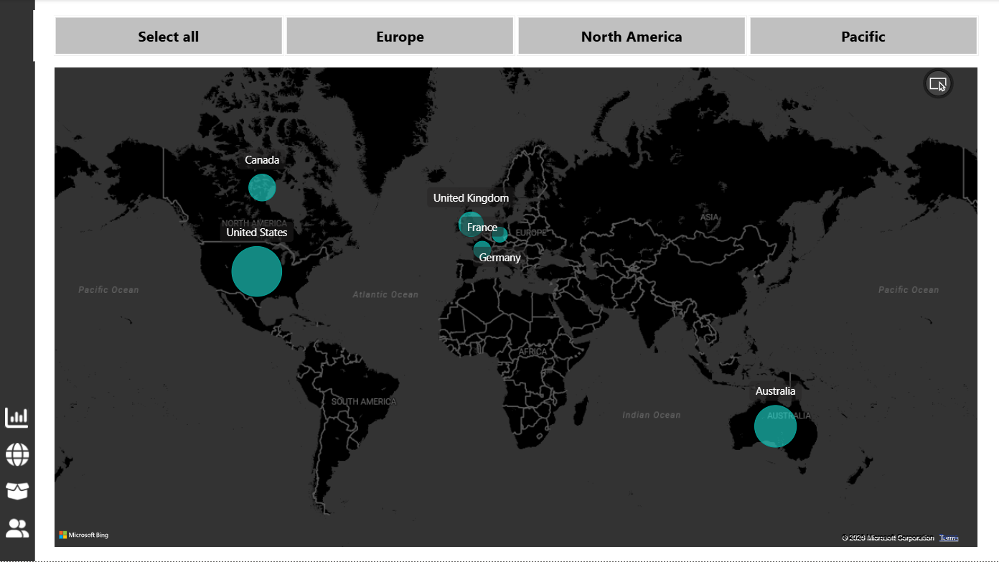
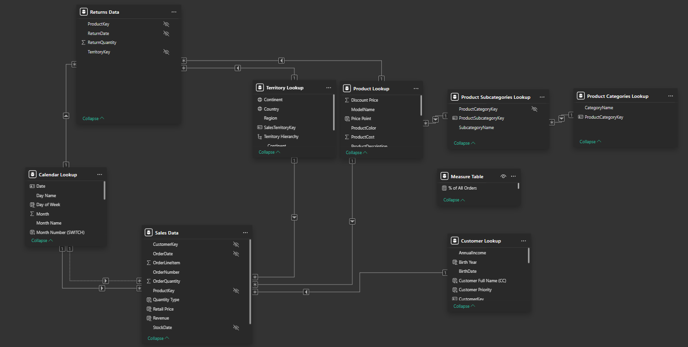

# AdventureWorks Sales Analytics Dashboard | Power BI

An interactive **Power BI Sales Performance Dashboard** for AdventureWorks Bike Shop, built using the AdventureWorks dataset from Kaggle. This project showcases end-to-end data analysis, visualization, and business intelligence skills.

---

## 📊 Project Overview

This dashboard provides comprehensive insights into **sales performance**, **profitability**, **customer behavior**, and **product trends** from 2020 to 2022.

### Key Metrics
- **Total Revenue**: $24.9 Million  
- **Total Profit**: $10.5 Million  
- **Total Orders**: 25.2K  
- **Return Rate**: 2.2%  
- **Unique Customers**: 17.4K

---

## ✨ Key Features

- **Executive Overview**: Revenue, Profit, Orders, and Return Rate KPIs with monthly trends
- **Geographic Analysis**: Sales distribution across North America, Europe, and Pacific regions
- **Product Performance**: Top 10 products, category-wise orders, and profitability analysis
- **Customer Analytics**: Segmentation by income level, occupation, and top customers
- **Star Schema Data Model**: Clean dimensional modeling for efficient analytics

---

## 📸 Screenshots

### 1. Executive Dashboard

### 2. Geographic Sales Map

### 3. Product Details Analysis

### 4. Customer Details & Segmentation

### 5. Power BI Data Model (Star Schema)

---

## 🛠️ Technologies & Skills Used

- **Power BI Desktop** – Data Modeling, Power Query, DAX
- **DAX** – Advanced measures, KPIs, and calculations
- **Star Schema Modeling** – Fact and Dimension tables
- **Data Visualization** – Interactive charts, maps, and slicers
- **Business Intelligence** – KPI reporting and actionable insights

---

## 🎯 Key Business Insights

- **Tires and Tubes** emerged as the most ordered product category
- **Shorts** identified as the highest return category
- Strong sales performance in **United States**, **Canada**, **Australia**, and **Europe**
- Identified top-performing customers for targeted marketing strategies
- Revenue showed consistent upward trend with clear seasonal patterns

---

## 📁 Repository Structure
